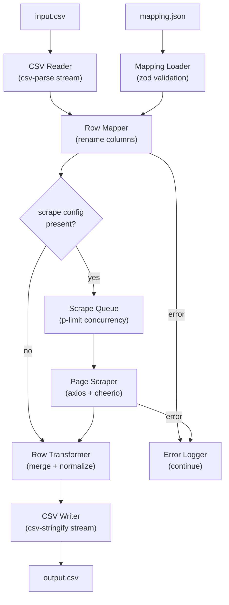

# Shopify CSV Importer — Architecture

## Data Flow




## Pipeline Design: Hybrid Streaming

The pipeline uses **streaming CSV I/O** with an **async processing queue** in the middle. This gives true backpressure on disk I/O while allowing clean async/await concurrency control for HTTP scraping — the most practical approach for 10k+ rows with mixed I/O work.

- **CSV Reader** pushes rows into an async iterator
- **Processing queue** (`p-limit`) controls how many rows are scraped in parallel
- **CSV Writer** is a writable stream flushed as results arrive

## Module Map

### `src/types/`

Single source of truth for all shared interfaces. No logic.

- `index.ts` — exports `MappingConfig`, `ScrapeConfig`, `FieldScrapeRule`, `SupplierRow`, `ShopifyRow`, `PipelineOptions`, `ScrapeResult`

### `src/mapping/`

Loads and validates `mapping.json`, then applies column renames.

- `loader.ts` — reads the JSON file, validates it with **zod**, throws on bad schema
- `mapper.ts` — `mapRow(supplierRow, config) → Partial<ShopifyRow>` (renames keys per `columns` block)

### `src/scraping/`

Fetches product URLs and extracts fields via CSS selectors.

- `scraper.ts` — `scrapeUrl(url, fields) → Promise<Partial<ShopifyRow>>` using axios + cheerio; handles `selector` and optional `attribute`
- `queue.ts` — wraps `p-limit` to export `createScrapeQueue(concurrency)` returning a typed limiter; all scrape calls go through this

### `src/csv/`

Pure streaming I/O with no business logic.

- `reader.ts` — `createCsvReader(filePath) → AsyncIterable<SupplierRow>` using `csv-parse` in streaming mode; yields one typed object per row
- `writer.ts` — `createCsvWriter(filePath, headers) → CsvWriter` wrapping `csv-stringify`; exposes `write(row)` and `end()`

### `src/transform/`

Merges the mapped columns and scraped fields into a final, validated Shopify row.

- `transformer.ts` — `transformRow(mapped, scraped) → ShopifyRow`; applies any field-level defaults, trims whitespace, handles empty strings

### `src/pipeline/`

Orchestrates the full end-to-end flow. This is the only module that imports from all others.

- `runner.ts` — `runPipeline(options: PipelineOptions) → Promise<PipelineResult>`; ties together reader → mapper → scrape queue → transformer → writer with per-row error catching and a final summary (`{ processed, failed, skipped }`)

### `src/cli/`

Thin CLI wrapper — no business logic, only argument parsing and calling `runPipeline`.

- `index.ts` — **commander** CLI; flags: `--input`, `--output`, `--mapping`, `--concurrency` (default 5), `--verbose`; validates file paths exist before starting

### `src/utils/`

Shared, stateless utilities.

- `logger.ts` — structured console logger with levels (info/warn/error); `--verbose` flag toggles debug output
- `errors.ts` — typed error classes: `MappingError`, `ScrapeError`, `CsvParseError`
- `retry.ts` — `withRetry(fn, attempts, delayMs)` for flaky HTTP requests

## Key Dependencies

- `csv-parse` — streaming CSV reader
- `csv-stringify` — streaming CSV writer
- `axios` — HTTP client
- `cheerio` — server-side HTML parsing
- `p-limit` — concurrency limiter
- `commander` — CLI argument parsing
- `zod` — runtime mapping config validation
- `typescript`, `tsx` — build/run

## Error Handling Contract

Every row is wrapped in an isolated `try/catch` inside `runner.ts`. Failures are logged with the row index and raw data, then execution continues. The process exits with code `1` only if **all** rows failed; partial failures exit `0` with a warning summary.

## File Structure

```
shopify-importer/
├── src/
│   ├── cli/index.ts
│   ├── csv/reader.ts
│   ├── csv/writer.ts
│   ├── mapping/loader.ts
│   ├── mapping/mapper.ts
│   ├── scraping/scraper.ts
│   ├── scraping/queue.ts
│   ├── transform/transformer.ts
│   ├── pipeline/runner.ts
│   ├── utils/logger.ts
│   ├── utils/errors.ts
│   ├── utils/retry.ts
│   └── types/index.ts
├── package.json
├── tsconfig.json
└── README.md
```
